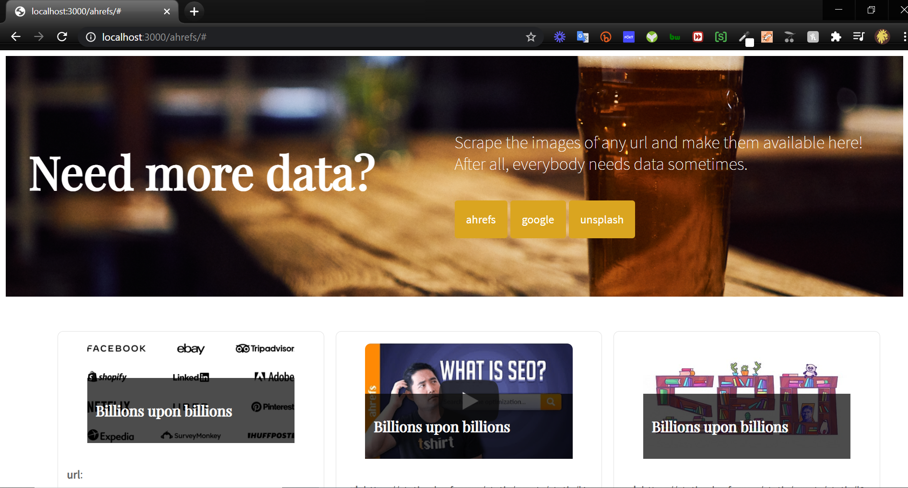

<h1>Fetch & View</h1>

 

<h1>Example Commands & Relevant Views</h1>

When you run:

scrape https://google.com google

The images will be available at:

http://localhost:3000/google

When you run:

scrape https://unsplash.com unsplash

The images will be available at:

http://localhost:3000/unsplash

